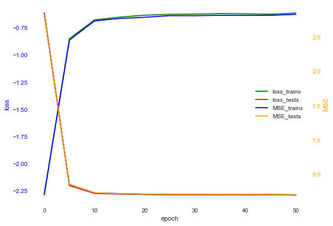
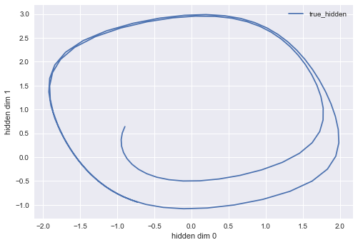
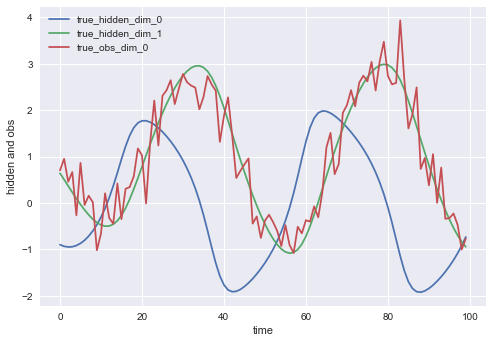
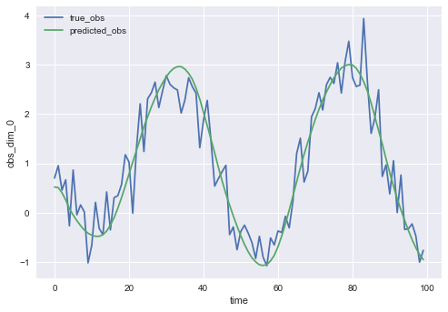
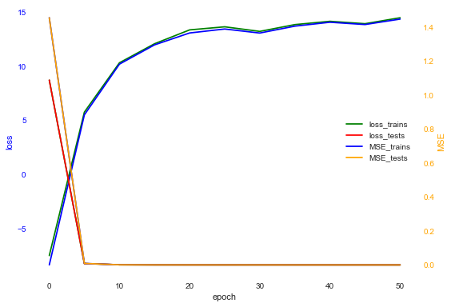
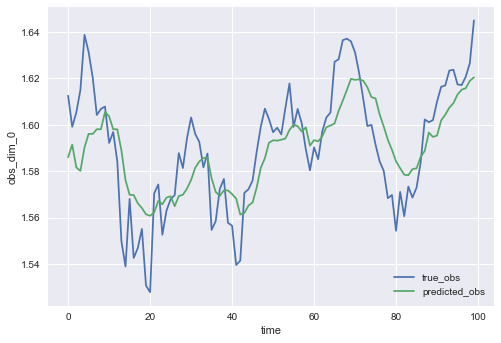
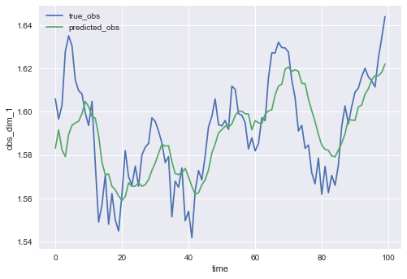
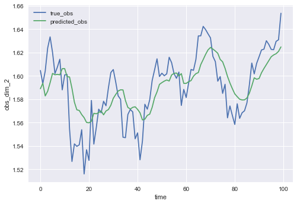
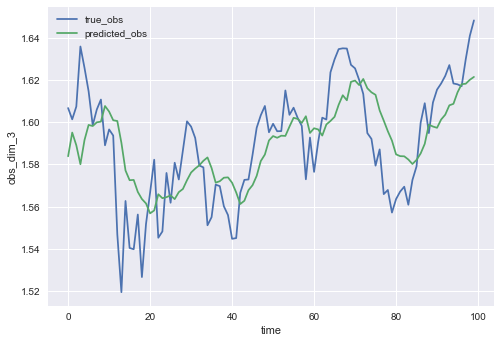
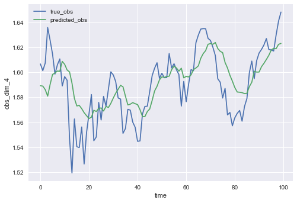

# Generative Time Series Forecasting

Zizhao Wang (UNI: zw2504)<br>
Liping Zhong (UNI: lz2638)

## Introduction

### Goal
Time series forecasting is an important area of machine learning. There are many prediction problems in different fields that involve a time component, like economic, weather, retail sales and stock price in this project.<br>

Prediction of stcok price is always a hard task because there are many factors affecting it and most of them are hard to be extracted and quantified as number. However, with the use of Variational Recurrent Neural Network (VRNN), we can let the model learn what hidden factors are behind the observation, i.e., stock prices.<br>

In our project, we applied VRNN Model to stock data and then explored two improvements to further increase the prediction accuracy.

### Background

#### Time Series Models

Time series models are probabilistic models over a sequence of hidden states (hidden variables) $z_{1:T}$ and observations $x_{1:T}$.

A time series model is characterized by an initial distribution $\nu(z_1)$, a series
of transition distributions $f_{t}(z_t|z_{1:t−1}, x_{1:t−1})$, and a series of emission distributions $g_{t}(x_t|z_{1:t}, x_{1:t-1})$ with the joint distribution being $p(z_{1:T}, x_{1:T}) = \nu(z_1) \prod_{t=2}^T f_{t}(z_t|z_{1:t−1}, x_{1:t−1}) \prod_{t=1}^T g_{t}(x_t|z_{1:t}, x_{1:t-1})$.

One simplification of time series model is the Hidden Markov Model (HMM) which is shown below. For HMM, transition distributions are simplified to $f(z_t|z_{t−1})$ and emission distributions to $g(x_t|z_t)$ with the joint $p(z_{1:T}, x_{1:T}) = \nu(z_1) \prod_{t=2}^T f(z_t|z_{t−1}) \prod_{t=1}^T g(x_t|z_t)$.


#### Recurrent Neural Network (RNN)

An popular tool to solve time series probelm is Recurrent Neural Network (RNN). An RNN can take a sequence of variables $v_{1:T}$ as inputs by recusively process each variable while maintaining its internal hidden state $h$. At each timestep $t$, the RNN takes $v_t$ and update its hidden states $h_t$ by:

$$h_t = u(v_t, h_{t-1}),$$

where $u$ is a deterministic non-linear function. Before taking any input, the initial hidden state of RNN $h_0$ is usually set as a vector of 0s.

#### Variational Auto-Encoder (VAE)
In many cases, the transition distribution $f$ and emission distribution $g$ are unknown, and we want to learn them from observations. One important idea supporting us to do is Variational Auto-Encoders (VAE) [[kingma2013](https://arxiv.org/abs/1312.6114)].


The image reference: [[vae_img](https://blog.shazam.com/learning-to-understand-music-from-shazam-56a60788b62f)]

A VAE jointly models the generative process from hidden variables $z$ to data $x$, and the recognition process from observed data $x$ to hidden variables $z$, using two distinct neural networks. The recoginition network $q_\phi(z|x^{(i)})$, also called encoder, derives a distribution over possible values of $z$ to approximate the posterior $p(z|x)$, given an observed datapoint $x^{(i)}$. The generative network $p_\theta(x|z)$, also called decoder, generates a distribution over possible values of $x$ given hidden variables $z$. $\theta$ and $\phi$ are parameters of generative networks and recoginition networks seperately, and they are learned by optimizing Evidence Lower Bound (ELBO):


As you may notice, the ELBO of VAE is quite close to the one in the lecture about Variation Inference, expect that $q(z)$ is changed to $q_\phi(z|x)$.

#### Variational Recurrent Neural Network (VRNN)
Finally, we move to the core idea behind this project, Variational Recurrent Neural Network (VRNN) [[chung2015recurrent](http://papers.nips.cc/paper/5653-a-recurrent-latent-variable-model-for-sequential-data)]. The VRNN contains a VAE at every timestep, but the VAEs are conditioned on both $x_t$ and the internal state variable $h_{t-1}$ of an RNN. This will help the VAE to take into account the temporal relationship in sequential data. In our project, long short-term memory (LSTM) is used as the RNN model.


The VRNN contains following operations, and the following image is an illustration of them:
* prior: $z_t \sim \mathcal{N}(\mu_{prior,t}, \text{diag}(\sigma_{prior,t}^2))$, where $[\mu_{prior,t}, \sigma_{prior,t}]=\varphi^{prior}(h_{t-1})$
* recognition (encoder): $z_t|x_t \sim \mathcal{N}(\mu_{enc,t}, \text{diag}(\sigma_{enc,t}^2))$, where $[\mu_{enc,t}, \sigma_{enc,t}]=\varphi^{enc}(\varphi^{x}(x_t), h_{t-1})$
* generation (decoder): $x_t|z_t \sim \mathcal{N}(\mu_{dec,t}, \text{diag}(\sigma_{dec,t}^2))$, where $[\mu_{dec,t}, \sigma_{dec,t}]=\varphi^{dec}(\varphi^{z}(z_t), h_{t-1})$
* feature extraction from $x_t$ and $z_t$, respectively: $\varphi^{x}$ and $\varphi^{z}$
* RNN update: $h_t=u(\varphi^{x}(x_t), \varphi^{z}(z_t), h_{t-1})$
<br><br><br>


<br><br><br>

Again, the parameters in all network are learned by optimizing following ELBO:


From above, the VRNN can learn the prior network $\varphi^{prior}$ as the transition distribution $f_{t}(z_t|z_{1:t−1}, x_{1:t−1})$ and the generation network $\varphi^{dec}$ as the emission distribution $g_{t}(x_t|z_{1:t}, x_{1:t−1})$. With $f$ and $g$, given $x_{1:t}$, we can make 1-step prediction $x_{t+1}$ as follows:

$$\tilde{z}_{t+1} \sim f_{t+1}(z_{t+1}|z_{1:t}, x_{1:t}) = \varphi^{prior}(h_{t})$$
$$\tilde{x}_{t+1} \sim g_{t+1}(x_{t+1}|[z_{1:t}, \tilde{z}_{t+1}], x_{1:t}) = \varphi^{dec}(\varphi^{z}(\tilde{z}_{t+1}), h_{t})$$
$$\tilde{h}_{t+1} = u(\varphi^{x}(\tilde{x}_{t+1}), \varphi^{z}(\tilde{z}_{t+1}), h_{t})$$

**In our project, we made 1-step prediction as above at every timestep and obtained predicted observation $\tilde{x}_{1:T}$.** <br>
One can also make $k$-step prediction by repeating the above procedures $k$ times. But as you can imagine, the prediction will become worse as steps increase.

### Data
There are two sources of data in our project. One is the data from simulation. We generated three kinds of data from three sets of transition distribution $f$ and emission distribution $g$. The number of dimensions of hidden variables and observation changes from distribution to distribution.<br>

The other is the stock data from three stock indexes: Dow Jones, Nasdaq and S&P 500. For each index, we have the data for the last 10 years, which is around 2,500 timesteps. For each timestep, the data has 5 dimensions which include Open, High, Low, Close and Adj Close. When training and testing, we randomly chose time series of length 100 from the whole data set of each index. The length is set to 100 because it is long enough for the model to learn and short enough to avoid consuming too much computational resources.  


<br>
## Observation Prediction using VRNN

To test the ability of VRNN to make accurate predictions, we conducted experiments with both simulation data and stock data. <br>
Since each experiment has its own $f$ and $g$ and requires to train a seperate VRNN model, it will take too long if the notebook runs all experiments (7 in total for VRNN). Hence, we will only show the following code demonstration for one $f$ and $g$ in detail, and results of other experiments are shown with presaved plots in the **Experiments** part after the code demonstration.

**To run the next experiment, please restart the ipython kernel. Otherwise, conflicts in tf graph might happen.**


```python
import numpy as np
import tensorflow as tf
import sys
import os
codebase = '../'
sys.path.append(codebase)
```

When using Python 3.6.2, the following import from files may throw some warnings because of bugs in Python. Other versions of Python may experience the same issue. It is okay just to ignore the warnings.


```python
from model import VRNNCell, VRNN_model
from data import get_stock_data
from sampler import create_train_test_dataset
from transformation import fhn, linear, lorenz
from distribution import dirac_delta, mvn
from trainer import trainer
from result_saving import create_RLT_DIR
from result_saving import plot_training, plot_training_2d
from result_saving import plot_loss_MSE
from result_saving import plot_hidden, plot_expression
from result_saving import plot_hidden_2d
```

    D:\Anaconda3\lib\importlib\_bootstrap.py:205: ImportWarning: can't resolve package from __spec__ or __package__, falling back on __name__ and __path__
      return f(*args, **kwds)
    D:\Anaconda3\lib\importlib\_bootstrap.py:205: ImportWarning: can't resolve package from __spec__ or __package__, falling back on __name__ and __path__
      return f(*args, **kwds)
    D:\Anaconda3\lib\importlib\_bootstrap.py:205: ImportWarning: can't resolve package from __spec__ or __package__, falling back on __name__ and __path__
      return f(*args, **kwds)
    D:\Anaconda3\lib\importlib\_bootstrap.py:205: ImportWarning: can't resolve package from __spec__ or __package__, falling back on __name__ and __path__
      return f(*args, **kwds)
    D:\Anaconda3\lib\importlib\_bootstrap.py:205: ImportWarning: can't resolve package from __spec__ or __package__, falling back on __name__ and __path__
      return f(*args, **kwds)
    D:\Anaconda3\lib\importlib\_bootstrap.py:205: ImportWarning: can't resolve package from __spec__ or __package__, falling back on __name__ and __path__
      return f(*args, **kwds)
    D:\Anaconda3\lib\importlib\_bootstrap.py:205: ImportWarning: can't resolve package from __spec__ or __package__, falling back on __name__ and __path__
      return f(*args, **kwds)
    D:\Anaconda3\lib\importlib\_bootstrap.py:205: ImportWarning: can't resolve package from __spec__ or __package__, falling back on __name__ and __path__
      return f(*args, **kwds)
    D:\Anaconda3\lib\importlib\_bootstrap.py:205: ImportWarning: can't resolve package from __spec__ or __package__, falling back on __name__ and __path__
      return f(*args, **kwds)
    

First, define some hyperparameters and create the directory to store results.


```python
time = 100                    # num of time steps
n_particles = 1               # when == 1 use VAE, when > 1 use Importance Weight AutoEncoder,
                              # will be introduced later
batch_size = 16

lr = 1e-4                     # learning rate
epoch = 50

n_train = 50 * batch_size     # number of data points in training data set
n_test = 1 * batch_size       # number of data points in testing data set

Dx = 1                        # dimension of the observation
Dz = 2                        # dimension of the hidden states
Dh = 100                      # dimension of the LSTM state used in VRNN

initial_state_all_zero = True # whether the LSTM state used in VRNN use zero_state as initial state

rslt_dir_name = "fhn"         # the results will be stored in 
                              # VRNN/final-project/results/"rslt_dir_name"/"some_name_depends_on_experiment_params"

experiment_params = {"time": time,
                     "n_particles": n_particles,
                     "batch_size": batch_size,
                     "lr": lr,
                     "epoch": epoch,
                     "initial_state_all_zero": initial_state_all_zero,
                     "rslt_dir_name": rslt_dir_name}
RLT_DIR = create_RLT_DIR(experiment_params)
```

Then generate the data set for training with simulation.<br>

In the simulation, we use the following setup: <br>
Hidden state $z_t$ are 2D. <br>
Observation $x_t$ are 1D. <br>
transition distributions $f(z_t|z_{t-1})$: use [FitzHugh–Nagumo model](https://en.wikipedia.org/wiki/FitzHugh%E2%80%93Nagumo_model), and it is deterministic<br> 
emission distributions $g(x_t|z_t)$: $\mathcal{N}(Bz_t, \Sigma)$, i.e., apply some linear transformation $B$ to hidden states $z_t$ with gaussian noise.<br>
initial distribution $\nu(z_1)$: $\text{Uniform}(-3,3)$ for each dimension of hidden states.


```python
# transition distribution
fhn_params = (1.0, 0.95, 0.05, 1.0, 0.15)
f_sample_tran = fhn.fhn_transformation(fhn_params)
f_sample_dist = dirac_delta.dirac_delta(f_sample_tran)

# emission distribution
linear_params = np.array([[0, 1]])
g_sample_tran = linear.linear_transformation(linear_params)
mvn_sigma = 0.2 * np.eye(1)
g_sample_dist = mvn.mvn(g_sample_tran, mvn_sigma)

# create data set
dataset = create_train_test_dataset(
    n_train=n_train,
    n_test=n_test,
    time=time,
    Dz=Dz,
    Dx=Dx,
    f=f_sample_dist,
    g=g_sample_dist,
    z_0=None,
    lb=-3,
    ub=3)
hidden_train, obs_train, hidden_test, obs_test = dataset
```

For the model, the VRNN cell uses a 2-layer multilayer perceptron (MLP) for prior, 2-layer MLP for recogition, 2-layer MLP for generation, 2-layer MLP for feature extraction of observation, and 2-layer MLP for feature extraction of hidden states.


```python
myVRNNCell = VRNNCell(Dx=Dx,
                      Dh=Dh,
                      Dz=Dz,
                      batch_size=batch_size,
                      n_particles=n_particles,
                      x_ft_Dhs=[100],
                      z_ft_Dhs=[100],
                      prior_Dhs=[100],
                      enc_Dhs=[100],
                      dec_Dhs=[100])
model = VRNN_model(myVRNNCell,
                   initial_state_all_zero=initial_state_all_zero,
                   is_lstm_Dh=50,
                   sigma_min=1e-3)
```


```python
mytrainer = trainer(model)
mytrainer.set_result_saving(RLT_DIR, save_freq=10, saving_num=batch_size)
mytrainer.set_data_set(hidden_train, obs_train, hidden_test, obs_test)
```

Next, we train the VRNN model with the generated dataset, it will print the loss (ELBO) and the MSE between true observation and predicted observation


```python
metrics, hidden_val, prediction_val = mytrainer.train(lr=lr,
                                                      epoch=epoch,
                                                      print_freq=5)

loss_trains, loss_tests, MSE_trains, MSE_tests = metrics
hidden_val_train, hidden_val_test = hidden_val
prediction_val_train, prediction_val_test = prediction_val

plot_loss_MSE(RLT_DIR, loss_trains, loss_tests, MSE_trains, MSE_tests, print_freq=5, show=True)
```

    iter    0, train loss: -2.287, test loss: -2.276, train MSE:  2.847934, test MSE:  2.826107
    iter    5, train loss: -0.850, test loss: -0.863, train MSE:  0.339765, test MSE:  0.353439
    iter   10, train loss: -0.678, test loss: -0.687, train MSE:  0.223870, test MSE:  0.231968
    iter   15, train loss: -0.652, test loss: -0.665, train MSE:  0.215517, test MSE:  0.221386
    iter   20, train loss: -0.635, test loss: -0.654, train MSE:  0.208211, test MSE:  0.213210
    iter   25, train loss: -0.627, test loss: -0.639, train MSE:  0.204829, test MSE:  0.210187
    iter   30, train loss: -0.625, test loss: -0.640, train MSE:  0.204291, test MSE:  0.210088
    iter   35, train loss: -0.620, test loss: -0.636, train MSE:  0.202261, test MSE:  0.207808
    iter   40, train loss: -0.622, test loss: -0.637, train MSE:  0.203020, test MSE:  0.207992
    iter   45, train loss: -0.626, test loss: -0.636, train MSE:  0.204314, test MSE:  0.208652
    iter   50, train loss: -0.615, test loss: -0.627, train MSE:  0.200172, test MSE:  0.204661
    finish training
    





To evaluate the model, we let the model make 1-step prediction of the observation and check if the predicted observation is close to true observation.

The following is the true hidden states (2D) and the true observaion (1D) generated from simulation.


```python
plot_training_2d(RLT_DIR,
                 hidden_test[0:1],
                 is_test=True,
                 show=True)
plot_training(RLT_DIR,
              hidden_test[0:1],
              obs_test[0:1],
              is_test=True,
              show=True)
```








The following is the comparison between the predicted observation and true observation:


```python
plot_expression(RLT_DIR,
                np.mean(prediction_val_test, axis=2)[0:1],
                obs_test[0:1],
                is_test=True,
                show=True)
```





From this plot, we can see the VRNN can make close and accurate prediction of observation. <br>
From $MSE_{train}=0.202$ and $MSE_{test}=0.193$ in the final epoch, we can see that the prediction errors are almost minimized to $MSE_{true}=0.2$.

### Experiments
As mentioned above, we generated our simulation data with three sets of transition distribution $f$ and emission distribution $g$. We started from simple linear distirbutions to complicated non-linear ones. We compared the predicted value to the true value to check whether our model could learn $f$ and $g$ well.

### Linear
The first f and g distribution we let our VRNN model learn is:<br>
$f$: linear transformation with Gaussian noise. Linear param: [[0.99,0.01],[0.2,0.8]], Noise covariance: [[1,0],[0,1]]<br>
$g$: linear transformation with Gaussian noise. Linear param: [[2,1],[1,2]], Noise covariance: [[1,0],[0,1]]<br>

The other settings are:<br>
Hidden state $z_t$ are 2D. <br>
Observation $x_t$ are 2D. <br>
initial distribution $\nu(z_1)$ is $\text{Uniform}(-3,3)$ for each dimension of hidden states.<br>

Our training and testing data is shown as below:

<table><tr>
<td>  </td>
<td>  </td>
</tr></table>

<br>
The loss and MSE during training is:<br>


<br>
The comparison between true and predicted value for hidden variable of testing data set:<br>
<table><tr>
<td>  </td>
<td>  </td>
</tr></table>

<br>
The comparison between true and predicted value for observation of testing data set:<br>
<table><tr>
<td>  </td>
<td>  </td>
</tr></table>

### Fhn
The second $f$ and $g$ distribution we let our VRNN model learn is:<br>
$f$: deterministic [FitzHugh–Nagumo model](https://en.wikipedia.org/wiki/FitzHugh%E2%80%93Nagumo_model) transformation. Fhn param: (1.0, 0.95, 0.05, 1.0, 0.15)<br>
$g$: linear transformation with Gaussian Noise. Linear param: [[0,1]], Noise covariance: [[0.2]]<br>

The other settings are:<br>
Hidden state $z_t$ are 2D. <br>
Observation $x_t$ are 1D. <br>
initial distribution $\nu(z_1)$ is $\text{Uniform}(-3,3)$ for each dimension of hidden states.<br>

Our training and testing data is shown as below:

<table><tr>
<td>  </td>
<td>  </td>
</tr></table>

<br>
The loss and MSE during training is:<br>


<br>
The comparison between true and predicted value for hidden variables of testing data set:<br>
<table><tr>
<td>  </td>
<td>  </td>
</tr></table>

<br>
The comparison for observations of training and testing data set.
<table><tr>
<td>  </td>
<td>  </td>
</tr></table>

### Lorenz
The third $f$ and $g$ distribution we let our VRNN model learn is:<br>
$f$: deterministic [Lorenz](https://en.wikipedia.org/wiki/Lorenz_system#Lorenz_attractor) transformation. Lorenz param: (10.0, 28.0, 8.0 / 3.0, 0.01)<br>

$g$: linear transformation with Gaussian Noise. Linear param: np.random.randn(3, 3), Noise covariance: [[1,0,0],[0,1,0],[0,0,1]]<br>

The other settings are:<br>
Hidden state $z_t$ are 3D. <br>
Observation $x_t$ are 3D. <br>
initial distribution $\nu(z_1)$ is $\text{Uniform}(-3,3)$ for each dimension of hidden states.<br>

Our training and testing data is shown as below:

<table><tr>
<td>  </td>
<td>  </td>
</tr></table>

<br>
The loss and MSE during training is:<br>


<br>
<br>
The comparison between true and predicted value for hidden variable of testing data set:<br>
<table><tr>
<td>  </td>
<td>  </td>
<td>  </td>
</tr></table>

<br>
The comparison between true and predicted value for observations of testing data set:<br>
<table><tr>
<td>  </td>
<td>  </td>
<td>  </td>
</tr></table>

### Stock
Finally, we applied the VRNN model to the stock data, we tested on [Dow Jones Industrial Average](https://en.wikipedia.org/wiki/Dow_Jones_Industrial_Average).
Here, the transition distribution $f$, emission distribution $g$ and initial state distribution $\nu$ are unknown. <br>
The hidden spaces are also unknown. <br>
The observation space are 5D, which are Open, Hight, Low, Close and Adjused Close.

Instead of simulation, the data set is generated by randomly selecting samples from the stock data in the last 10 years.<br>
Besides, to make training easier, we scaled the stock index by their average value so that the observation values are mostly around 1 rather than something around 10000.

Since we cannot compare hidden states, we can only compare the 1-step observation prediction from VRNN model and true observation.

The loss and MSE during training is:<br>


The follwing plots are some comparisons between predicted observation and true observation: <br>
Note that since the Dow Jones index won't change dramatically most of the time, all 5 dimensions of observation are quite close. To save time and the place of notebook, we just show 2 of them Open and Adjusted Close below. <br>

<table>
<tr>
<td>  </td>
<td>  </td>
<td>  </td>
</tr>
<td>  </td>
<td>  </td>
<td>  </td>
</table>

<br>
**As one may notice, the prediction of stock index is close to the true values most of the time, except for the prediction at the beginning.**<br>
As a quantitative evaluation, the final MSE between predicted observation and true observation is 0.00111 on testing dataset, which means:
* for 62% of the time, the prediction error in stock price change will be < 1%.
* for 86% of the time, the prediction error in stock price change will be < 2%.

The initial prediction is poor because the initial state of the LSTM of VRNN $h_0$ is set as a vector of 0s. There may be some way to fix it.

<br>
## Learn Initial State with the Bidirectional RNN
As argued before, before the RNN takes any inputs, its hidden state $h_0$ is usually set as a vector of 0s. It means the initial distribution $\nu$ is not learnable and set to some constant values. As a result, the VRNN has poor performance in the beginning. <br>
[[sussillo2016lfads](https://arxiv.org/abs/1608.06315)] proposed a solution, i.e., learning the initial distribution $\nu$ with the bidirectional RNN with observations as input, shown as below:


Then it samples an initial state from $\nu(z_1)$ and continue with an architecture similar to VRNN to infer the hidden states $z_{1:T}$. <br>
Notice that it uses all observations $x_{1:T}$ when calculating $\nu(z_1)$, it would be cheating if our project applies the same method, because all observations are already seen by the model before the model predicts them. So we modified the method and only use first half of observation $x_{1:T/2}$ as the input of the bidirectional RNN, shown as follows. In this way, the second half of observations $x_{T/2:T}$ are not seen by the model and it will predict them.


**To run the next experiment, please restart the ipython kernel. Otherwise, conflicts in tf graph might happen.**


```python
import numpy as np
import tensorflow as tf
import sys
import os
codebase = '../'
sys.path.append(codebase)
```


```python
from model import VRNNCell, VRNN_model
from data import get_stock_data
from sampler import create_train_test_dataset
from transformation import fhn, linear, lorenz
from distribution import dirac_delta, mvn
from trainer import trainer
from result_saving import create_RLT_DIR
from result_saving import plot_training, plot_training_2d
from result_saving import plot_loss_MSE
from result_saving import plot_hidden, plot_expression
```

The changes in hyperparameter are
* ```initial_state_all_zero``` changes from ```True``` to ```False```.
* ```Dz``` increases from ```5``` to ```50```.


```python
time = 100                     # num of time steps
n_particles = 1                # when == 1 use VAE, when > 1 use Importance Weight AutoEncoder,
                               # will be introduced later
batch_size = 16

lr = 1e-4
epoch = 50

n_train = 50 * batch_size
n_test = 1 * batch_size

Dx = 5                         # dimension of the observation
Dz = 50                        # dimension of the hidden states
Dh = 100                       # dimension of the LSTM state used in VRNN

initial_state_all_zero = False # whether the LSTM state used in VRNN use zero_state as initial state

rslt_dir_name = "dow_jones"    # the results will be stored in 
                               # VRNN/final-project/results/"rslt_dir_name"/"some_name_depends_on_experiment_params"

experiment_params = {"time": time,
                     "n_particles": n_particles,
                     "batch_size": batch_size,
                     "lr": lr,
                     "epoch": epoch,
                     "initial_state_all_zero": initial_state_all_zero,
                     "rslt_dir_name": rslt_dir_name}
RLT_DIR = create_RLT_DIR(experiment_params)
```

Next, we get training and testing dataset from stock data files. Hidden states are unknown and set to ```None```.


```python
obs_train, obs_test = get_stock_data("dow_jones", time, n_train, n_test, Dx)
hidden_train = hidden_test = None
```

The model gets more complex with more layers in all networks.


```python
myVRNNCell = VRNNCell(Dx=Dx,
                      Dh=Dh,
                      Dz=Dz,
                      batch_size=batch_size,
                      n_particles=n_particles,
                      x_ft_Dhs=[100, 100],
                      z_ft_Dhs=[100, 100],
                      prior_Dhs=[100, 100, 100],
                      enc_Dhs=[100, 100, 100],
                      dec_Dhs=[100, 100, 100])
model = VRNN_model(myVRNNCell,
                   initial_state_all_zero=initial_state_all_zero,
                   is_lstm_Dh=50,
                   sigma_min=1e-3)
```


```python
mytrainer = trainer(model)
mytrainer.set_result_saving(RLT_DIR, save_freq=10, saving_num=batch_size)
mytrainer.set_data_set(hidden_train, obs_train, hidden_test, obs_test)
```


```python
metrics, hidden_val, prediction_val = mytrainer.train(lr=lr,
                                                      epoch=epoch,
                                                      print_freq=5)

loss_trains, loss_tests, MSE_trains, MSE_tests = metrics
hidden_val_train, hidden_val_test = hidden_val
prediction_val_train, prediction_val_test = prediction_val

plot_loss_MSE(RLT_DIR, loss_trains, loss_tests, MSE_trains, MSE_tests, print_freq=5, show=True)
```

    iter    0, train loss: -7.529, test loss: -8.392, train MSE:  1.088173, test MSE:  1.455707
    iter    5, train loss:  5.757, test loss:  5.503, train MSE:  0.008177, test MSE:  0.009007
    iter   10, train loss: 10.327, test loss: 10.201, train MSE:  0.000858, test MSE:  0.000916
    iter   15, train loss: 12.090, test loss: 11.985, train MSE:  0.000383, test MSE:  0.000443
    iter   20, train loss: 13.373, test loss: 13.088, train MSE:  0.000277, test MSE:  0.000357
    iter   25, train loss: 13.659, test loss: 13.455, train MSE:  0.000241, test MSE:  0.000276
    iter   30, train loss: 13.235, test loss: 13.082, train MSE:  0.000289, test MSE:  0.000314
    iter   35, train loss: 13.864, test loss: 13.720, train MSE:  0.000233, test MSE:  0.000253
    iter   40, train loss: 14.169, test loss: 14.082, train MSE:  0.000210, test MSE:  0.000242
    iter   45, train loss: 13.947, test loss: 13.869, train MSE:  0.000224, test MSE:  0.000242
    iter   50, train loss: 14.500, test loss: 14.373, train MSE:  0.000188, test MSE:  0.000213
    finish training
    





```python
Again, we can compare how accurate the predicted observation is 
```


```python
plot_expression(RLT_DIR,
                np.mean(prediction_val_test, axis=2)[0:1],
                obs_test[0:1],
                is_test=True,
                show=True)
```

















As noticed, the bidirectional RNN successfully learn the initial distribution, and the predicted observation in the beginning becomes closer to ground truth. The prediction accuracy may be poor compared to previous results, and we will explain why later.

### Experiments

After the improvements of the model, we first let the model learn the $f$ and $g$ from generated data.<br>
The $f$ and $g$ sets we chose are the same as specified in the VRNN Experiemnts part.<br>

### Linear
For $f$:linear, $g$:linear:<br>
Our training and testing data generated is as below:

<table><tr>
<td>  </td>
<td>  </td>
</tr></table>

<br>
The loss and MSE during training is:<br>


<br>
The comparison between true and predicted value for hidden variable of testing data set:<br>
<table><tr>
<td>  </td>
<td>  </td>
</tr></table>

<br>
The comparison between true and predicted value for observation of testing data set:<br>
<table><tr>
<td>  </td>
<td>  </td>
</tr></table>

### Fhn
For $f$: [FitzHugh–Nagumo model](https://en.wikipedia.org/wiki/FitzHugh%E2%80%93Nagumo_model), $g$: linear with param: [[0,1]]<br>

Our training and testing data generated is as below:

<table><tr>
<td>  </td>
<td>  </td>
</tr></table>

<br>
The loss and MSE during training is:<br>


<br>
The comparison for observations of training and testing data set.
<table><tr>
<td>  </td>
<td>  </td>
</tr></table>

### Lorenz
For $f$: [Lorenz](https://en.wikipedia.org/wiki/Lorenz_system#Lorenz_attractor), $g$: linear<br>

Our training and testing data generated is as below:

<table><tr>
<td>  </td>
<td>  </td>
</tr></table>

<br>
The loss and MSE during training is:<br>


<br>
<br>
The comparison between true and predicted value for hidden variable of testing data set:<br>
<table><tr>
<td>  </td>
<td>  </td>
<td>  </td>
</tr></table>

<br>
The comparison between true and predicted value for observations of testing data set:<br>
<table><tr>
<td>  </td>
<td>  </td>
<td>  </td>
</tr></table>

### Stock
Though we have demonstrated our code with Dow Jones stock data above, we still want to show the experiments results with stock data. The reason is, similar to many deep networks, **the performance of our model depends on the selected random seed**. As a result, we trained our model with different random seeds and picked the one with best performance, and thus the code demonstration above may not have as good performance as results shown below.

The followings are some comparison between predicted observations and true observations using Dow Jones dataset:

<table>
<tr>
<td>  </td>
<td>  </td>
<td>  </td>
</table>

<br>

As a quantitative evaluation, the final MSE between predicted observation and true observation is 0.00016 on testing dataset, **decreased by 86%** compared with not learning the initial state. As well,
* for 72% of the time, the prediction error in stock price change will be < 1%, **increased by 10%.**
* for 92% of the time, the prediction error in stock price change will be < 2%, **increased by 6%.**

We got similar results on Nasdaq Composite and Standard & Poor's 500 data. Due to limitation of space and time, we will not analysis them in detail here.

Results of Nasdaq Composite:

<table>
<tr>
<td>  </td>
<td>  </td>
<td>  </td>
</table>

Results of Standard & Poor's 500:

<table>
<tr>
<td>  </td>
<td>  </td>
<td>  </td>
</table>

<br>

<br>
## Importance Weight Auto-Encoder (IWAE)

As you may notice in the hyperparameters part of the code, there is a variable called ```n_particles``` and when ```n_particles > 1```, the model will use IWAE rather than VAE. So what is difference between IWAE and VAE, and how will it affect the performance of our model?

IWAE is a followup of VAE. It uses the same architecture as VAE, with a recogition network $q_{\phi}(z|x^{(i)})$ and a generative network $p_{\theta}(x|z)$. As a reminder, the ELBO of VAE is as follows:


Instead of sampling one hidden value $z_1$ from recogition network $q_{\phi}(z|x^{(i)})$, IWAE samples $k$ hidden values $z_1, \dots, z_k$ and uses the following ELBO.


Observe, when $k=1$, $\mathcal{L}_{IWAE} = \mathcal{L}_{VAE}$. When $k>1$, IWAE outperforms VAE by providing a tighter ELBO. It is proved that:

$$\log p(x) \ge \mathcal{L}_{IWAE,k+1} \ge \mathcal{L}_{IWAE,k}$$
<br>
$$\lim_{k \rightarrow \infty} \mathcal{L}_{IWAE,k} = \log p(x)$$

As a result, using IWAE and increase number of samples (```n_particles```) will improve the performance of our model. However, the computational resource needed increases linearly with the number of samples, and it is impossible for one to use infinite samples to achieve the optimal performance. <br>
Due to the limitation of time, we only finished a few experiments on some of the data.

### Experiments
### Fhn

For $f$: [FitzHugh–Nagumo model](https://en.wikipedia.org/wiki/FitzHugh%E2%80%93Nagumo_model), $g$: linear with param: [[0,1]]<br>

Our training and testing data generated is as below:

<table><tr>
<td>  </td>
<td>  </td>
</tr></table>

<br>
The loss and MSE during training is:<br>


<br>
The comparison between true and predicted value for hidden variables of testing data set:<br>
<table><tr>
<td>  </td>
<td>  </td>
</tr></table>

<br>
The comparison for observations of training and testing data set.
<table><tr>
<td>  </td>
<td>  </td>
</tr></table>

<br>
<br>
For $f$: [FitzHugh–Nagumo model](https://en.wikipedia.org/wiki/FitzHugh%E2%80%93Nagumo_model), $g$: linear with param: [[1,1]]<br>
The only difference from above $f$ and $g$ is the linear param for $g$.<br>

Our training and testing data generated is as below:

<table><tr>
<td>  </td>
<td>  </td>
</tr></table>

<br>
The loss and MSE during training is:<br>


<br>
The comparison between true and predicted value for hidden variables of testing data set:<br>
<table><tr>
<td>  </td>
<td>  </td>
</tr></table>

<br>
The comparison for observations of training and testing data set:<br>
<table><tr>
<td>  </td>
<td>  </td>
</tr></table>

## Conclusion and Future Works

Through iteration of Box's loop, our project shows the following:
* The Variational Recurrent Neural Network can be used for accurate predictions.
* Learning the initial state for VRNN with bidirectional RNN can improve prediction accuracy.
* Importance Weight Auto-Encoder can be a promising technique to merge into VRNN.

The encouraging results of VRNN and remained unfinished experiments on IWAE motive our group to look further into this topic. 
* We would apply IWAE to stock data, and check how the performance improves as number of samples $k$ increases.
* Learning from the idea of particle filtering, [[le2017auto](https://arxiv.org/abs/1705.10306)] and [[maddison2017filtering](https://arxiv.org/abs/1705.09279)] proposes models similar to IWAE but with resampling at every/a certain timestep, and those models achieve better performance on sequential data. It would be interesting to build similar models to apply to stock data and check the performance improvement.

## Reference
[[kingma2013auto](https://arxiv.org/abs/1312.6114)] Kingma, Diederik P., and Max Welling. "Auto-encoding variational bayes." arXiv preprint arXiv:1312.6114 (2013).

[[chung2015recurrent](http://papers.nips.cc/paper/5653-a-recurrent-latent-variable-model-for-sequential-data)] Chung, Junyoung, et al. "A recurrent latent variable model for sequential data." Advances in neural information processing systems. 2015.

[[burda2015importance](https://arxiv.org/abs/1509.00519)] Burda, Yuri, Roger Grosse, and Ruslan Salakhutdinov. "Importance weighted autoencoders." arXiv preprint arXiv:1509.00519 (2015).

[[sussillo2016lfads](https://arxiv.org/abs/1608.06315)] Sussillo, David, et al. "LFADS-latent factor analysis via dynamical systems." arXiv preprint arXiv:1608.06315 (2016).

[[le2017auto](https://arxiv.org/abs/1705.10306)] Le, Tuan Anh, et al. "Auto-Encoding Sequential Monte Carlo." arXiv preprint arXiv:1705.10306 (2017).

[[maddison2017filtering](https://arxiv.org/abs/1705.09279)] Maddison, Chris J., et al. "Filtering variational objectives." Advances in Neural Information Processing Systems. 2017.
